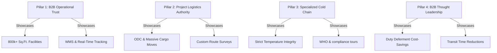

# Genex Logistics: B2B Facebook Audit & Growth Strategy
**Prepared by:** Head of Marketing, Genex Logistics  
**Target Channel:** Facebook Page ([facebook.com/GenExLogistics](https://www.facebook.com/GenExLogistics))  
**Objective:** Transition Facebook from an underperforming profile into a high-credibility B2B lead generation and brand-trust channel.

---

## 1. Executive Summary & Strategic Vision

Historically, industrial logistics and third-party logistics (3PL) providers have treated Facebook as a passive channel, posting generic stock images or national holiday greetings. For **Genex Logistics**, this represents a major missed opportunity. 

In B2B logistics, target stakeholders (Procurement Managers, Supply Chain Directors, CFOs, and EXIM Heads) conduct multi-channel research before awarding multi-million rupee contracts. A high-authority, active, and operationally transparent Facebook page builds immediate credibility. Our goal is to leverage Facebook to **showcase our 800,000+ sq. ft. warehouse infrastructure, cold chain capabilities, Free Trade Warehousing Zone (FTWZ) solutions, and heavy-lift project logistics mastery**, turning impressions into qualified corporate inquiries.

---

## 2. Current Social Media Audit ("As-Is" Gaps)

Our audit of the current page highlights several critical areas requiring immediate resolution:

1. **Visual Identity Gaps:** 
   - *Issue:* Static cover photo lacks professional branding and fails to show operations in motion.
   - *Solution:* Replace with a 15-second high-definition drone reel showcasing active warehousing hubs, cargo handling, and fleet dispatch.
2. **Content Authenticity Deficit:**
   - *Issue:* Too many stock photos and standard holiday templates. These do not demonstrate our real capacities.
   - *Solution:* Shift to 100% original, verified media from our active warehouses, shipping terminals, and heavy lift project locations.
3. **Absence of B2B Conversion Funnel:**
   - *Issue:* The primary page Call-To-Action (CTA) is "Send Message" with no automated B2B routing.
   - *Solution:* Update the CTA to link directly to a "Get a Supply Chain Quote" portal and implement a structured Facebook Messenger automated chatbot flow.
4. **Lack of Tracking & Retargeting:**
   - *Issue:* No integration between website traffic and Facebook campaign tracking.
   - *Solution:* Implement the Meta Pixel on the main website to retarget warm corporate visitors.

---

## 3. Core B2B Target Buyer Personas

Unlike B2C marketing, B2B social media campaigns target specific corporate decision makers:

### Persona A: Supply Chain & Operations Directors
*   **Industry Focus:** Manufacturing, Retail, Consumer Goods, Automotive.
*   **Key Pain Points:** Unreliable transit schedules, warehouse inventory shrinkage, scaling footprints during peak seasons, lack of real-time tracking.
*   **What they look for on Facebook:** Operational scale, warehouse cleanliness, advanced WMS systems, and robust logistics infrastructure.

### Persona B: Sourcing & Procurement Managers
*   **Industry Focus:** General Trading, Engineering, Corporate Operations.
*   **Key Pain Points:** Contract rigidity, poor customer responsiveness, rising cost per shipment.
*   **What they look for on Facebook:** Client references, safety accreditations, and cost-efficient 3PL solutions.

### Persona C: Import-Export (EXIM) & Customs Heads
*   **Industry Focus:** International Trade, Raw Material Importers.
*   **Key Pain Points:** Locked up working capital in customs duty payments, customs clearance bottlenecks.
*   **What they look for on Facebook:** Specialized knowledge in Free Trade Warehousing Zones (FTWZ), bonded warehouses, and customs duty saving strategies.

### Persona D: Pharmaceutical Supply Chain Leads
*   **Industry Focus:** Healthcare, Pharma, Biotech.
*   **Key Pain Points:** Product spoilage due to temperature fluctuations, regulatory non-compliance, lack of validated transport.
*   **What they look for on Facebook:** Temperature mapping records, cold storage equipment tours, and compliance accreditations (WHO/GDP).

---

## 4. Strategic Content & Growth Pillars ("To-Be" Plan)

We will partition our content calendar into four thematic pillars designed to educate, engage, and convert:



### Pillar 1: B2B Operational Trust
*   **Objective:** Visually demonstrate scale, technology, and organization.
*   **Execution:** Short warehouse walkthroughs, live demonstrations of sorting/scanning, highlighting vertical layout racking, and showing active dispatch loaders.

### Pillar 2: Project Logistics Authority (The B2B "Wow" Factor)
*   **Objective:** Show capability to handle complex, high-risk freight tasks.
*   **Execution:** Post videos and photo series showing the transit of massive boilers, industrial turbines, or heavy steel structures. Emphasize the planning, route surveys, and safety steps taken.

### Pillar 3: Specialized Cold Chain Integrity
*   **Objective:** Position Genex as the premium pharmaceutical logistics partner of choice.
*   **Execution:** Educational content on cold chain validation, detailing multi-temperature storage zones, showing backup refrigeration systems, and sharing certifications.

### Pillar 4: Thought Leadership & Custom Duty Optimization
*   **Objective:** Educate import-export heads on cash flow optimizations.
*   **Execution:** Explainer graphics showing how Genex FTWZ facilities allow companies to store imported goods customs-duty-free, delaying tax payments until items are shipped.

---

## 5. Weekly B2B Content Matrix

A consistent, structured weekly flow ensures steady organic exposure:

| Day | Focus Category | Content Format | Target Angle & CTA |
| :--- | :--- | :--- | :--- |
| **Monday** | Operations Showcase | Video Reel / High-Quality Photo | **Showcasing scale:** Tour of the Dwarka logistics terminal. Focus on vertical integration and WMS tracking. *CTA: Book a Facility Tour.* |
| **Wednesday** | B2B Case Study | Explainer Infographic | **Demonstrating ROI:** "How Genex optimized retail supply chain routing to cut customs clearance delays by 22%." *CTA: Read Case Study.* |
| **Thursday** | Project Logistics | Image Carousel | **Displaying capability:** Photo series moving a 100-tonne generator from port to plant. Details on road clearances. *CTA: Speak to Cargo Experts.* |
| **Friday** | People & Safety | Employee Quote + Photo | **Humanizing the brand:** Spotlighting shift managers maintaining 100+ accident-free days at warehouses. *CTA: View Safety Code.* |

---

## 6. Paid Campaign & Lead Generation Funnel

Organic reach on Facebook is low; therefore, we must run targeted paid campaigns to capture corporate business leads:

```
[Awareness (TOFU)]
  └── Target: B2B Video views showing drone tours of warehouses or ODC heavy cargo transport.
  
[Credibility (MOFU)]
  └── Target: Retarget users who watched >50% of the video with Case Studies & FTWZ cost benefits.
  
[Conversion (BOFU)]
  └── Target: Lead Gen Form Ads offering a "Free 30-Minute Supply Chain Custom Duty Audit."
```

1. **Top of Funnel (TOFU) - Brand Awareness:**
   - *Targeting:* Broad B2B logistics interests (e.g., Supply Chain Management, Procurement, Freight Forwarding).
   - *Format:* Short video highlights of major cargo transport accomplishments.
2. **Middle of Funnel (MOFU) - Retargeting & Consideration:**
   - *Targeting:* Custom audience of users who viewed >50% of the TOFU videos or visited the Genex website.
   - *Format:* Client testimonials, infographics detailing FTWZ customs duty deferral, and specialized pharma compliance documents.
3. **Bottom of Funnel (BOFU) - Lead Capture:**
   - *Targeting:* High-intent retargeting audience.
   - *Format:* Lead form campaigns offering a "Free 30-Minute Supply Chain Audit" or "Custom Freight Shipping Estimate."

---

## 7. Strategy Roadmap & Timeline (First 90 Days)

### Day 1 - 30: Foundation & Branding Setup
- Update Facebook cover image to custom branded video reel.
- Configure profile parameters, business contact details, map location, and CTA links.
- Set up Meta Pixel on the website to begin tracking visitor custom audiences.

### Day 31 - 60: Content Implementation & Warm Up
- Launch the weekly posting cadence (Monday, Wednesday, Thursday, Friday).
- Establish standard corporate templates for graphic assets to maintain visual continuity.
- Launch the TOFU Video Views campaigns using active operational reels.

### Day 61 - 90: Lead Generation & Scale
- Initiate MOFU retargeting ads highlighting case studies.
- Set up and launch B2B Lead Forms inside Facebook Ads Manager.
- Track metrics (CPM, CPC, Lead Conversion, ROI) and optimize bidding styles.
